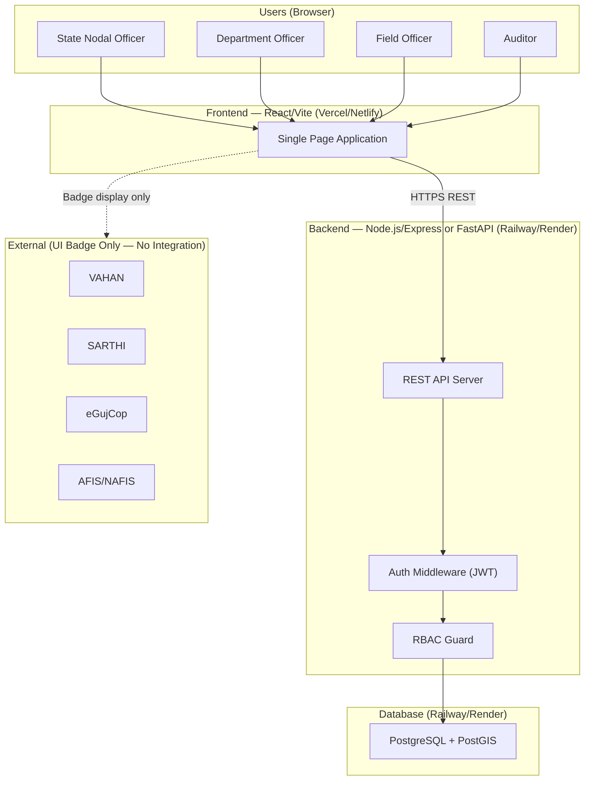
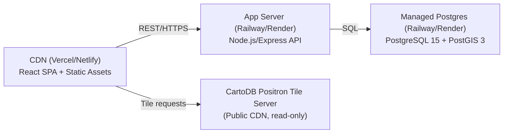
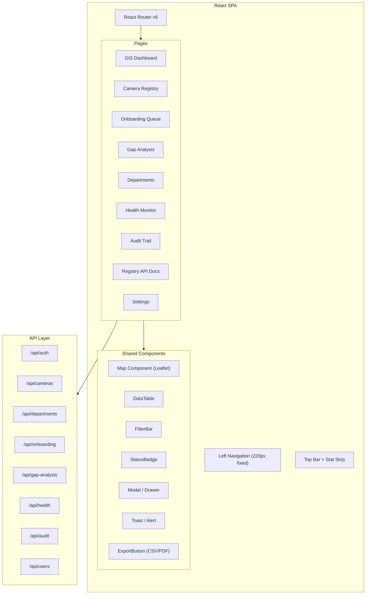
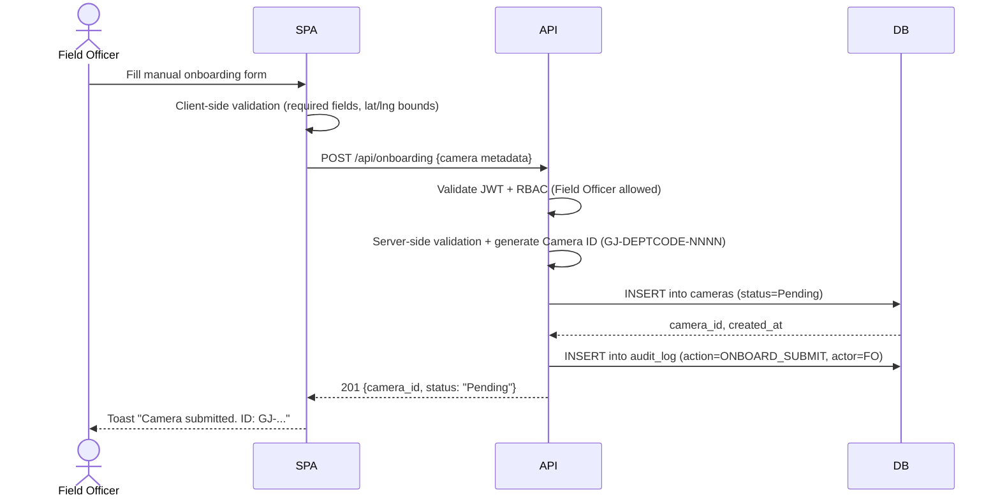
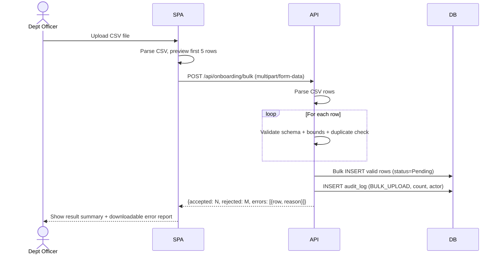
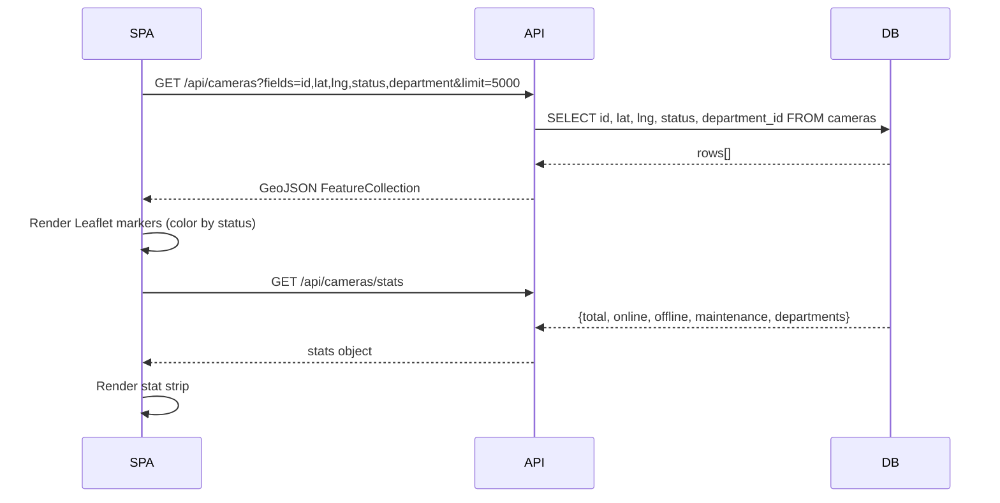
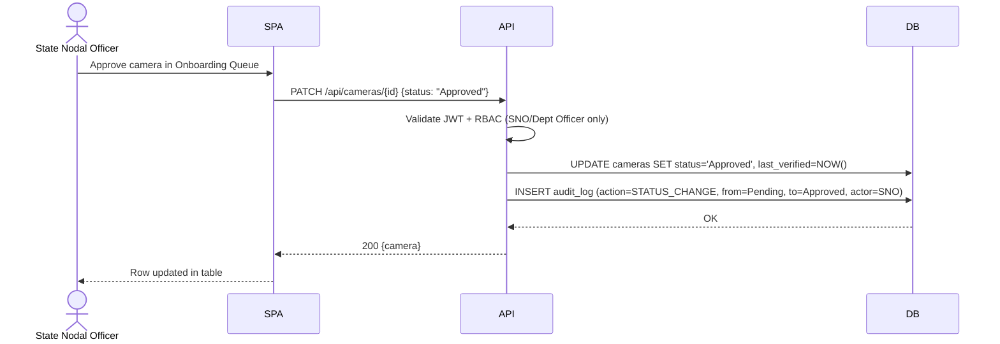

# Design Document: SETU Registry — Centralised CCTV Registry & GIS Foundation

## Overview

SETU (Surveillance Equipment Tracking Utility) Registry is a metadata and asset-visibility platform for the Gujarat Police Innovation Challenge 2026. It provides a single source of truth for ~80,000 CCTV cameras across 26 Gujarat government departments — enabling onboarding, search, geographic visualisation, gap analysis, and audit logging of camera metadata. The system deliberately handles **only metadata** (no live video, no AI/analytics) and is designed as internal government operations software: functional, data-dense, and low-ornamentation.

The platform is structured as a React SPA (Vite) backed by a Node.js/Express (or FastAPI) REST API, with a PostgreSQL + PostGIS database. Role-based access control (RBAC) governs four roles: State Nodal Officer, Department Officer, Field Officer, and Auditor.

---

## Architecture

### System Context Diagram



### Deployment Architecture



### High-Level Component Map



---

## Sequence Diagrams

### Camera Onboarding (Manual Form)



### Bulk CSV Onboarding



### GIS Dashboard Load



### State Change + Audit Log



---

## Components and Interfaces

### 1. AuthService

**Purpose**: Issues and validates JWT tokens; enforces RBAC per route.

**Interface**:
```typescript
interface AuthService {
  login(username: string, password: string): Promise<AuthResult>
  validateToken(token: string): TokenPayload | null
  hasPermission(payload: TokenPayload, resource: Resource, action: Action): boolean
  refreshToken(token: string): Promise<string>
}

type Role = "state_nodal_officer" | "department_officer" | "field_officer" | "auditor"

interface TokenPayload {
  userId: string
  role: Role
  departmentId: string | null   // null for SNO and Auditor (cross-dept)
  exp: number
}

interface AuthResult {
  token: string
  user: UserProfile
}
```

**RBAC Matrix**:

| Role | Cameras (read) | Cameras (write) | Cameras (approve) | Users (manage) | Audit (read) |
|------|---------------|-----------------|-------------------|----------------|-------------|
| state_nodal_officer | All | All | Yes | Yes | All |
| department_officer | Own dept | Own dept | Own dept | No | Own dept |
| field_officer | Own dept | Submit only | No | No | Own |
| auditor | All | No | No | No | All |

---

### 2. CameraService

**Purpose**: Core CRUD and query operations for camera metadata.

**Interface**:
```typescript
interface CameraService {
  list(filters: CameraFilters, pagination: Pagination, role: TokenPayload): Promise<PaginatedResult<Camera>>
  getById(id: string, role: TokenPayload): Promise<Camera>
  create(data: CameraInput, actor: TokenPayload): Promise<Camera>
  update(id: string, data: Partial<CameraInput>, actor: TokenPayload): Promise<Camera>
  bulkImport(rows: CameraInput[], actor: TokenPayload): Promise<BulkImportResult>
  exportCSV(filters: CameraFilters, role: TokenPayload): Promise<Buffer>
  getStats(role: TokenPayload): Promise<CameraStats>
  getGeoJSON(filters: CameraFilters, role: TokenPayload): Promise<GeoJSONFeatureCollection>
}

interface CameraFilters {
  departmentId?: string
  districtId?: string
  status?: CameraStatus[]
  cameraType?: CameraType[]
  connectivity?: ConnectivityType[]
  search?: string           // free-text on name, location, ID
  onboardedAfter?: Date
  onboardedBefore?: Date
}

interface Pagination {
  page: number             // 1-indexed
  pageSize: number         // default 50, max 500
  sortBy?: keyof Camera
  sortOrder?: "asc" | "desc"
}
```

---

### 3. OnboardingService

**Purpose**: Manages the onboarding lifecycle queue (Pending → Validation → Approved/Rejected).

**Interface**:
```typescript
interface OnboardingService {
  submitManual(data: CameraInput, actor: TokenPayload): Promise<OnboardingEntry>
  submitBulkCSV(fileBuffer: Buffer, actor: TokenPayload): Promise<BulkImportResult>
  getQueue(filters: QueueFilters, role: TokenPayload): Promise<PaginatedResult<OnboardingEntry>>
  approve(cameraId: string, actor: TokenPayload): Promise<Camera>
  reject(cameraId: string, reason: string, actor: TokenPayload): Promise<void>
  getValidationErrors(cameraId: string): Promise<ValidationError[]>
}

type OnboardingStatus = "Pending" | "Validation" | "Approved" | "Rejected"

interface OnboardingEntry {
  id: string
  cameraId: string
  status: OnboardingStatus
  submittedBy: string
  submittedAt: Date
  reviewedBy?: string
  reviewedAt?: Date
  rejectionReason?: string
  validationErrors: ValidationError[]
}
```

---

### 4. GapAnalysisService

**Purpose**: Computes coverage gaps, ageing alerts, and below-average district rankings.

**Interface**:
```typescript
interface GapAnalysisService {
  getLowCoverageZones(threshold: number): Promise<GapZone[]>
  getAgeingInfrastructure(thresholdDays: number): Promise<Camera[]>
  getBelowAverageDistricts(): Promise<DistrictRanking[]>
  exportReport(format: "csv" | "pdf"): Promise<Buffer>
}

interface GapZone {
  districtId: string
  districtName: string
  cameraCount: number
  avgPerDistrict: number
  deficit: number
  coordinates: [number, number]   // centroid [lat, lng]
}

interface DistrictRanking {
  districtId: string
  districtName: string
  cameraCount: number
  onlineRate: number        // 0–1
  rank: number
  belowAverage: boolean
}
```

---

### 5. AuditService

**Purpose**: Append-only log of every state-changing action.

**Interface**:
```typescript
interface AuditService {
  log(entry: AuditInput): Promise<void>
  list(filters: AuditFilters, pagination: Pagination): Promise<PaginatedResult<AuditEntry>>
  getForCamera(cameraId: string): Promise<AuditEntry[]>
}

type AuditAction =
  | "ONBOARD_SUBMIT" | "ONBOARD_APPROVE" | "ONBOARD_REJECT"
  | "STATUS_CHANGE" | "CAMERA_UPDATE" | "CAMERA_DELETE"
  | "BULK_UPLOAD" | "EXPORT" | "LOGIN" | "USER_CREATE" | "USER_UPDATE"

interface AuditEntry {
  id: string
  action: AuditAction
  actorId: string
  actorRole: Role
  targetId?: string         // camera_id or user_id
  targetType?: "camera" | "user"
  before?: object           // snapshot before change
  after?: object            // snapshot after change
  metadata?: object         // extra context (row count, filename, etc.)
  createdAt: Date
  ipAddress?: string
}
```

---

### 6. HealthMonitorService

**Purpose**: Flags cameras needing attention; simulates status drift for demo purposes.

**Interface**:
```typescript
interface HealthMonitorService {
  getFlaggedCameras(role: TokenPayload): Promise<FlaggedCamera[]>
  getTrendData(days: number, role: TokenPayload): Promise<HealthTrendPoint[]>
  simulateStatusChange(cameraId: string, newStatus: CameraStatus): Promise<void>
  getAlertSummary(role: TokenPayload): Promise<AlertSummary>
}

interface FlaggedCamera {
  camera: Camera
  flagReason: "Offline" | "Maintenance" | "Not_Verified_90d" | "Retention_Expiring"
  flaggedAt: Date
  severity: "low" | "medium" | "high"
}

interface HealthTrendPoint {
  date: string          // ISO date
  online: number
  offline: number
  maintenance: number
}
```

---

## Data Models

### Camera (Core Entity)

```typescript
interface Camera {
  id: string                      // GJ-DEPTCODE-NNNNNN (e.g. GJ-POL-000042)
  name: string                    // Location name / descriptive label
  departmentId: string            // FK → departments.id
  districtId: string              // FK → districts.id
  latitude: number                // WGS84, precision 6 decimal places
  longitude: number               // WGS84, precision 6 decimal places
  cameraType: CameraType          // "IP" | "Analog" | "PTZ" | "ANPR"
  connectivity: ConnectivityType  // "Fiber" | "4G" | "Microwave" | "Other"
  storageType: StorageType        // "Local NVR" | "Cloud" | "Hybrid"
  retentionDays: number           // 1–365
  ownership: OwnershipType        // "Govt" | "Private"
  status: CameraStatus            // "Online" | "Maintenance" | "Offline"
  onboardedAt: Date
  lastVerifiedAt: Date | null
  onboardedBy: string             // FK → users.id
  onboardingMethod: OnboardingMethod  // "Manual" | "Bulk CSV" | "API"
  onboardingStatus: OnboardingStatus
  notes?: string
  createdAt: Date
  updatedAt: Date
}
```

**Validation Rules**:
- `id`: Must match regex `/^GJ-[A-Z]{2,6}-\d{6}$/`
- `latitude`: Must be within Gujarat bounds: [20.1°N, 24.7°N]
- `longitude`: Must be within Gujarat bounds: [68.2°E, 74.5°E]
- `retentionDays`: Integer, 1–365
- `name`: Non-empty, max 200 chars
- `departmentId`: Must exist in departments table

### Department

```typescript
interface Department {
  id: string            // e.g. "POL", "RTO", "FIRE"
  name: string          // Full department name
  nodal_officer_name: string
  nodal_officer_email: string
  cameraCount?: number  // computed/denormalized
  createdAt: Date
}
```

### District (Lookup)

```typescript
interface District {
  id: string           // e.g. "AHM", "SUR", "VAD"
  name: string         // "Ahmedabad", "Surat", "Vadodara" …
  centroidLat: number
  centroidLng: number
  region: string       // "Central Gujarat", "South Gujarat", etc.
}
```

### User

```typescript
interface User {
  id: string
  username: string
  email: string
  passwordHash: string
  role: Role
  departmentId: string | null   // null for SNO, Auditor
  isActive: boolean
  createdAt: Date
  lastLoginAt: Date | null
}
```

### AuditLog (DB table — append-only)

```typescript
interface AuditLog {
  id: string           // UUID v4
  action: AuditAction
  actorId: string
  actorRole: Role
  targetId: string | null
  targetType: "camera" | "user" | null
  before: object | null   // JSONB
  after: object | null    // JSONB
  metadata: object | null // JSONB
  ipAddress: string | null
  createdAt: Date
}
```

---

## Database Schema

### PostgreSQL DDL (PostGIS enabled)

```sql
-- Enable PostGIS
CREATE EXTENSION IF NOT EXISTS postgis;
CREATE EXTENSION IF NOT EXISTS "uuid-ossp";

-- Lookup tables
CREATE TABLE districts (
    id          VARCHAR(10) PRIMARY KEY,
    name        VARCHAR(100) NOT NULL,
    centroid    GEOMETRY(POINT, 4326),
    region      VARCHAR(60)
);

CREATE TABLE departments (
    id                   VARCHAR(10) PRIMARY KEY,
    name                 VARCHAR(150) NOT NULL,
    nodal_officer_name   VARCHAR(100),
    nodal_officer_email  VARCHAR(150),
    created_at           TIMESTAMPTZ DEFAULT NOW()
);

-- Users
CREATE TABLE users (
    id              UUID PRIMARY KEY DEFAULT uuid_generate_v4(),
    username        VARCHAR(60) UNIQUE NOT NULL,
    email           VARCHAR(150) UNIQUE NOT NULL,
    password_hash   VARCHAR(255) NOT NULL,
    role            VARCHAR(30) NOT NULL CHECK (role IN (
                        'state_nodal_officer','department_officer',
                        'field_officer','auditor')),
    department_id   VARCHAR(10) REFERENCES departments(id),
    is_active       BOOLEAN DEFAULT TRUE,
    created_at      TIMESTAMPTZ DEFAULT NOW(),
    last_login_at   TIMESTAMPTZ
);

-- Core cameras table
CREATE TABLE cameras (
    id                  VARCHAR(30) PRIMARY KEY,   -- GJ-DEPTCODE-NNNNNN
    name                VARCHAR(200) NOT NULL,
    department_id       VARCHAR(10) NOT NULL REFERENCES departments(id),
    district_id         VARCHAR(10) NOT NULL REFERENCES districts(id),
    location            GEOMETRY(POINT, 4326) NOT NULL,
    camera_type         VARCHAR(20) NOT NULL CHECK (camera_type IN ('IP','Analog','PTZ','ANPR')),
    connectivity        VARCHAR(20) NOT NULL CHECK (connectivity IN ('Fiber','4G','Microwave','Other')),
    storage_type        VARCHAR(20) NOT NULL CHECK (storage_type IN ('Local NVR','Cloud','Hybrid')),
    retention_days      SMALLINT NOT NULL CHECK (retention_days BETWEEN 1 AND 365),
    ownership           VARCHAR(20) NOT NULL CHECK (ownership IN ('Govt','Private')),
    status              VARCHAR(20) NOT NULL DEFAULT 'Pending'
                            CHECK (status IN ('Online','Maintenance','Offline','Pending')),
    onboarding_status   VARCHAR(20) NOT NULL DEFAULT 'Pending'
                            CHECK (onboarding_status IN ('Pending','Validation','Approved','Rejected')),
    onboarding_method   VARCHAR(20) NOT NULL CHECK (onboarding_method IN ('Manual','Bulk CSV','API')),
    onboarded_by        UUID NOT NULL REFERENCES users(id),
    onboarded_at        TIMESTAMPTZ DEFAULT NOW(),
    last_verified_at    TIMESTAMPTZ,
    notes               TEXT,
    created_at          TIMESTAMPTZ DEFAULT NOW(),
    updated_at          TIMESTAMPTZ DEFAULT NOW()
);

-- Spatial index for GIS queries
CREATE INDEX idx_cameras_location ON cameras USING GIST(location);
-- Composite index for common filter patterns
CREATE INDEX idx_cameras_dept_status ON cameras(department_id, status);
CREATE INDEX idx_cameras_district ON cameras(district_id);
CREATE INDEX idx_cameras_onboarding ON cameras(onboarding_status);

-- Audit log (append-only — no UPDATE/DELETE granted on this table)
CREATE TABLE audit_log (
    id            UUID PRIMARY KEY DEFAULT uuid_generate_v4(),
    action        VARCHAR(30) NOT NULL,
    actor_id      UUID NOT NULL REFERENCES users(id),
    actor_role    VARCHAR(30) NOT NULL,
    target_id     VARCHAR(50),
    target_type   VARCHAR(20),
    before_state  JSONB,
    after_state   JSONB,
    metadata      JSONB,
    ip_address    INET,
    created_at    TIMESTAMPTZ DEFAULT NOW()
);

CREATE INDEX idx_audit_actor ON audit_log(actor_id);
CREATE INDEX idx_audit_target ON audit_log(target_id);
CREATE INDEX idx_audit_created ON audit_log(created_at DESC);

-- Onboarding validation errors (transient)
CREATE TABLE onboarding_errors (
    id          UUID PRIMARY KEY DEFAULT uuid_generate_v4(),
    camera_id   VARCHAR(30) REFERENCES cameras(id) ON DELETE CASCADE,
    field       VARCHAR(60),
    message     TEXT,
    created_at  TIMESTAMPTZ DEFAULT NOW()
);
```

---

## Algorithmic Pseudocode

### Camera ID Generation

```pascal
ALGORITHM generateCameraId(departmentId, conn)
INPUT:  departmentId : String  -- e.g. "POL"
        conn         : DBConnection
OUTPUT: cameraId     : String  -- e.g. "GJ-POL-000042"

PRECONDITIONS:
  - departmentId is a valid 2-6 uppercase letter code
  - conn is open and writable

POSTCONDITIONS:
  - Returned id matches /^GJ-[A-Z]{2,6}-\d{6}$/
  - id is unique in cameras table
  - id is generated atomically (no race condition)

BEGIN
  LOCK sequence_lock FOR departmentId

  next_seq ← conn.queryOne(
    "SELECT COALESCE(MAX(CAST(SPLIT_PART(id,'-',3) AS INT)), 0) + 1
     FROM cameras WHERE department_id = $1", [departmentId]
  )

  padded ← LPAD(TOSTRING(next_seq), 6, '0')
  cameraId ← CONCAT("GJ-", departmentId, "-", padded)

  ASSERT cameraId MATCHES /^GJ-[A-Z]{2,6}-\d{6}$/

  UNLOCK sequence_lock FOR departmentId
  RETURN cameraId
END
```

### CSV Bulk Validation

```pascal
ALGORITHM validateBulkCSV(rows, existingIds, departments, districts)
INPUT:  rows        : List<Map<String, String>>  -- parsed CSV rows
        existingIds : Set<String>                -- IDs already in DB
        departments : Set<String>                -- valid dept codes
        districts   : Set<String>                -- valid district IDs
OUTPUT: result      : BulkValidationResult
          .valid    : List<CameraInput>
          .errors   : List<{row: Int, field: String, message: String}>

PRECONDITIONS:
  - rows is non-empty
  - existingIds, departments, districts are loaded from DB

POSTCONDITIONS:
  - Each entry in result.valid passes all validation rules
  - Each entry in result.errors identifies the row number and failing field
  - result.valid ∪ result.errors covers every input row

BEGIN
  valid  ← EMPTY LIST
  errors ← EMPTY LIST
  seenInBatch ← EMPTY SET   -- detect duplicates within the batch itself

  FOR i ← 0 TO LENGTH(rows) - 1 DO
    -- Loop invariant: all previously accepted rows in `valid` are fully valid
    ASSERT ∀ c ∈ valid: isValidCamera(c)

    row       ← rows[i]
    rowErrors ← EMPTY LIST

    // Required field checks
    FOR each field IN [name, department_id, district_id, latitude,
                       longitude, camera_type, connectivity,
                       storage_type, retention_days, ownership] DO
      IF row[field] IS EMPTY THEN
        APPEND {row: i+1, field: field, message: "Required field missing"} TO rowErrors
      END IF
    END FOR

    // Lat/Lng bounds (Gujarat)
    lat ← PARSE_FLOAT(row.latitude)
    lng ← PARSE_FLOAT(row.longitude)
    IF lat < 20.1 OR lat > 24.7 THEN
      APPEND {row: i+1, field: "latitude", message: "Outside Gujarat bounds [20.1, 24.7]"} TO rowErrors
    END IF
    IF lng < 68.2 OR lng > 74.5 THEN
      APPEND {row: i+1, field: "longitude", message: "Outside Gujarat bounds [68.2, 74.5]"} TO rowErrors
    END IF

    // Enum checks
    IF row.camera_type NOT IN {"IP", "Analog", "PTZ", "ANPR"} THEN
      APPEND {row: i+1, field: "camera_type", message: "Invalid value"} TO rowErrors
    END IF
    IF row.connectivity NOT IN {"Fiber", "4G", "Microwave", "Other"} THEN
      APPEND {row: i+1, field: "connectivity", message: "Invalid value"} TO rowErrors
    END IF

    // FK checks
    IF row.department_id NOT IN departments THEN
      APPEND {row: i+1, field: "department_id", message: "Unknown department"} TO rowErrors
    END IF
    IF row.district_id NOT IN districts THEN
      APPEND {row: i+1, field: "district_id", message: "Unknown district"} TO rowErrors
    END IF

    // Duplicate check (DB + batch)
    IF row.id IS NOT EMPTY THEN
      IF row.id IN existingIds OR row.id IN seenInBatch THEN
        APPEND {row: i+1, field: "id", message: "Duplicate camera ID"} TO rowErrors
      ELSE
        ADD row.id TO seenInBatch
      END IF
    END IF

    IF rowErrors IS EMPTY THEN
      APPEND parsedCamera(row) TO valid
    ELSE
      APPEND ALL rowErrors TO errors
    END IF
  END FOR

  ASSERT LENGTH(valid) + countRowsWithErrors(errors) = LENGTH(rows)
  RETURN BulkValidationResult(valid, errors)
END
```

### RBAC Guard (Middleware)

```pascal
ALGORITHM rbacGuard(token, resource, action, ownDeptId)
INPUT:  token      : String       -- raw JWT from Authorization header
        resource   : Resource     -- e.g. CAMERAS, USERS, AUDIT_LOG
        action     : Action       -- READ | WRITE | APPROVE | MANAGE
        ownDeptId  : String|null  -- camera's dept (for scoping checks)
OUTPUT: decision   : {allowed: Boolean, scopedTo: String|null}

PRECONDITIONS:
  - token is a non-empty string
  - JWT_SECRET is set in environment

POSTCONDITIONS:
  - If allowed = false, caller MUST return HTTP 403
  - scopedTo is non-null only when role=department_officer restricts a dept

BEGIN
  payload ← verifyJWT(token, JWT_SECRET)
  IF payload IS NULL OR payload.exp < NOW() THEN
    RETURN {allowed: false, scopedTo: null}
  END IF

  role ← payload.role

  CASE role OF
    "state_nodal_officer":
      RETURN {allowed: true, scopedTo: null}

    "auditor":
      IF action = READ THEN
        RETURN {allowed: true, scopedTo: null}
      ELSE
        RETURN {allowed: false, scopedTo: null}
      END IF

    "department_officer":
      IF action IN {READ, WRITE, APPROVE} THEN
        IF ownDeptId IS NULL OR ownDeptId = payload.departmentId THEN
          RETURN {allowed: true, scopedTo: payload.departmentId}
        ELSE
          RETURN {allowed: false, scopedTo: null}
        END IF
      ELSE
        RETURN {allowed: false, scopedTo: null}
      END IF

    "field_officer":
      IF resource = CAMERAS AND action = WRITE THEN
        RETURN {allowed: true, scopedTo: payload.departmentId}
      ELSE IF action = READ AND ownDeptId = payload.departmentId THEN
        RETURN {allowed: true, scopedTo: payload.departmentId}
      ELSE
        RETURN {allowed: false, scopedTo: null}
      END IF

    DEFAULT:
      RETURN {allowed: false, scopedTo: null}
  END CASE
END
```

### Gap Analysis — Low Coverage Zones

```pascal
ALGORITHM getLowCoverageZones(threshold, conn)
INPUT:  threshold : Number        -- fraction of average, e.g. 0.5 = below 50% of avg
        conn      : DBConnection
OUTPUT: zones     : List<GapZone>

PRECONDITIONS:
  - threshold ∈ (0, 1)
  - conn is readable

POSTCONDITIONS:
  - Each zone.cameraCount < threshold × avgPerDistrict
  - zones is sorted by deficit DESC

BEGIN
  districtCounts ← conn.query(
    "SELECT d.id, d.name,
            ST_X(d.centroid) AS lng, ST_Y(d.centroid) AS lat,
            COUNT(c.id) AS camera_count
     FROM districts d
     LEFT JOIN cameras c ON c.district_id = d.id
                        AND c.onboarding_status = 'Approved'
     GROUP BY d.id, d.name, d.centroid"
  )

  total    ← SUM(row.camera_count FOR row IN districtCounts)
  avgCount ← total / LENGTH(districtCounts)
  cutoff   ← threshold × avgCount

  zones ← EMPTY LIST
  FOR each row IN districtCounts DO
    IF row.camera_count < cutoff THEN
      APPEND GapZone(
        districtId:    row.id,
        districtName:  row.name,
        cameraCount:   row.camera_count,
        avgPerDistrict: avgCount,
        deficit:       avgCount - row.camera_count,
        coordinates:   [row.lat, row.lng]
      ) TO zones
    END IF
  END FOR

  SORT zones BY deficit DESCENDING
  RETURN zones
END
```

### Health Monitor — Flagging Algorithm

```pascal
ALGORITHM flagUnhealthyCameras(cameras, now)
INPUT:  cameras : List<Camera>
        now     : Timestamp
OUTPUT: flagged : List<FlaggedCamera>

PRECONDITIONS:
  - cameras is non-empty
  - now is current UTC timestamp

POSTCONDITIONS:
  - Each entry in flagged satisfies at least one flag condition
  - Severity is assigned based on condition type

BEGIN
  flagged ← EMPTY LIST
  DAYS_90 ← 90 * 24 * 60 * 60  -- seconds

  FOR each cam IN cameras DO
    -- Loop invariant: all cameras processed so far have been correctly evaluated
    severity ← null
    reason   ← null

    IF cam.status = "Offline" THEN
      reason   ← "Offline"
      severity ← "high"
    ELSE IF cam.status = "Maintenance" THEN
      reason   ← "Maintenance"
      severity ← "medium"
    ELSE IF cam.lastVerifiedAt IS NULL
         OR (now - cam.lastVerifiedAt) > DAYS_90 THEN
      reason   ← "Not_Verified_90d"
      severity ← "medium"
    ELSE IF cam.retentionDays < 7 THEN
      reason   ← "Retention_Expiring"
      severity ← "low"
    END IF

    IF reason IS NOT NULL THEN
      APPEND FlaggedCamera(camera: cam, flagReason: reason,
                           flaggedAt: now, severity: severity) TO flagged
    END IF
  END FOR

  SORT flagged BY severityOrder(severity) DESCENDING, flaggedAt ASCENDING
  RETURN flagged
END

FUNCTION severityOrder(severity)
  CASE severity OF
    "high":   RETURN 3
    "medium": RETURN 2
    "low":    RETURN 1
    DEFAULT:  RETURN 0
  END CASE
END FUNCTION
```

---

## Key Functions with Formal Specifications

### `listCameras(filters, pagination, actor)`

```typescript
async function listCameras(
  filters: CameraFilters,
  pagination: Pagination,
  actor: TokenPayload
): Promise<PaginatedResult<Camera>>
```

**Preconditions:**
- `actor.role` is a valid Role
- `pagination.page >= 1` and `pagination.pageSize` is in [1, 500]
- If `actor.role === "department_officer"`, `actor.departmentId` is non-null

**Postconditions:**
- If `actor.role === "department_officer"`, all returned cameras have `departmentId === actor.departmentId`
- `result.total` reflects the filtered count (not page count)
- `result.data.length <= pagination.pageSize`
- No camera with `onboardingStatus === "Rejected"` is visible to `field_officer`

**Loop Invariants:** N/A (SQL query, no application-level loop)

---

### `validateCameraInput(input)`

```typescript
function validateCameraInput(input: CameraInput): ValidationResult
```

**Preconditions:**
- `input` is a defined object (may have missing or invalid fields)

**Postconditions:**
- Returns `{valid: true, errors: []}` iff all fields pass every rule
- `errors` is non-empty iff `valid === false`
- No mutation of `input`
- Idempotent: calling twice with same input yields same result

---

### `appendAuditLog(entry, conn)`

```typescript
async function appendAuditLog(entry: AuditInput, conn: DBConnection): Promise<void>
```

**Preconditions:**
- `entry.action` is a valid AuditAction
- `entry.actorId` references an existing user
- `conn` is within an open transaction

**Postconditions:**
- Exactly one row inserted in `audit_log`
- Row is immutable after insert (no UPDATE/DELETE permissions on table)
- If the enclosing transaction rolls back, the audit entry also rolls back (atomicity)

---

### `getGeoJSON(filters, actor)`

```typescript
async function getGeoJSON(
  filters: CameraFilters,
  actor: TokenPayload
): Promise<GeoJSONFeatureCollection>
```

**Preconditions:**
- `actor` is authenticated with a valid, non-expired token

**Postconditions:**
- Returns a valid GeoJSON `FeatureCollection` (RFC 7946)
- Each `Feature.geometry` is a `Point` with `[lng, lat]` coordinate order
- Each `Feature.properties` includes at minimum: `id`, `status`, `departmentId`, `cameraType`
- Result is scoped by `actor.departmentId` for `department_officer` and `field_officer`

---

## Example Usage

### REST API Examples

```typescript
// 1. Authenticate
POST /api/auth/login
{
  "username": "snodal_officer",
  "password": "secret"
}
→ { "token": "eyJ...", "user": { "id": "...", "role": "state_nodal_officer" } }


// 2. List cameras with filters (paginated)
GET /api/cameras?status=Offline&departmentId=POL&page=1&pageSize=50
Authorization: Bearer eyJ...
→ {
    "data": [{ "id": "GJ-POL-000042", "name": "Ahmedabad Ring Road Cam 1", ... }],
    "total": 3,
    "page": 1,
    "pageSize": 50
  }


// 3. Get GeoJSON for map render
GET /api/cameras/geojson?status=Online,Offline
Authorization: Bearer eyJ...
→ {
    "type": "FeatureCollection",
    "features": [
      {
        "type": "Feature",
        "geometry": { "type": "Point", "coordinates": [72.5714, 23.0225] },
        "properties": { "id": "GJ-POL-000042", "status": "Online", "departmentId": "POL" }
      }
    ]
  }


// 4. Submit manual onboarding
POST /api/onboarding
Authorization: Bearer eyJ...
{
  "name": "Surat Highway Junction Cam",
  "departmentId": "POL",
  "districtId": "SUR",
  "latitude": 21.1702,
  "longitude": 72.8311,
  "cameraType": "PTZ",
  "connectivity": "Fiber",
  "storageType": "Cloud",
  "retentionDays": 30,
  "ownership": "Govt"
}
→ { "id": "GJ-POL-000043", "onboardingStatus": "Pending" }


// 5. Bulk CSV upload
POST /api/onboarding/bulk
Authorization: Bearer eyJ...
Content-Type: multipart/form-data
file: cameras_batch.csv
→ {
    "accepted": 45,
    "rejected": 3,
    "errors": [
      { "row": 7, "field": "latitude", "message": "Outside Gujarat bounds" },
      { "row": 12, "field": "department_id", "message": "Unknown department" }
    ]
  }


// 6. Gap analysis
GET /api/gap-analysis?threshold=0.5
Authorization: Bearer eyJ...
→ {
    "zones": [
      { "districtId": "DAN", "districtName": "Dang", "cameraCount": 2, "avgPerDistrict": 21.4, "deficit": 19.4 }
    ]
  }
```

---

## Correctness Properties

*A property is a characteristic or behaviour that should hold true across all valid executions of a system — essentially, a formal statement about what the system should do. Properties serve as the bridge between human-readable specifications and machine-verifiable correctness guarantees.*

### Property 1: RBAC Isolation for Department Officers

*For any* authenticated Department_Officer actor and any camera returned by a list or GeoJSON query, the camera's departmentId SHALL equal the actor's departmentId.

**Validates: Requirements 2.2, 2.7, 8.5, 10.8**

---

### Property 2: Audit Completeness

*For any* state-changing operation (create, update, delete, approve, reject, bulk upload, export, login) executed successfully on a Camera or User resource, there SHALL exist exactly one audit log entry whose targetId matches the resource ID and whose createdAt timestamp is within the same transaction.

**Validates: Requirements 13.1, 7.4, 9.3, 9.4, 15.3, 15.4**

---

### Property 3: Camera ID Format Invariant

*For any* camera stored in the database, the Camera_ID SHALL match the regular expression `/^GJ-[A-Z]{2,6}-\d{6}$/`.

**Validates: Requirements 3.2, 4.1**

---

### Property 4: Geographic Coordinate Constraint

*For any* camera record accepted by the system, the latitude SHALL be in the range [20.1, 24.7] and the longitude SHALL be in the range [68.2, 74.5].

**Validates: Requirements 3.3**

---

### Property 5: Onboarding Status Monotonicity

*For any* camera in the system, the sequence of Onboarding_Status values recorded in the audit log SHALL follow only the permitted transitions: `Pending → Validation`, `Pending → Rejected`, `Validation → Approved`, `Validation → Rejected`. No reverse or undefined transitions SHALL appear.

**Validates: Requirements 7.5**

---

### Property 6: Auditor Write Rejection

*For any* API request using an Auditor JWT where the HTTP method is POST, PUT, PATCH, or DELETE, the system SHALL return HTTP 403 and no data shall be modified.

**Validates: Requirements 2.4**

---

### Property 7: Retention Days Bounds

*For any* camera record accepted by the system, retentionDays SHALL be an integer in the range [1, 365].

**Validates: Requirements 3.4**

---

### Property 8: GeoJSON Coordinate Order

*For any* GeoJSON feature returned by the GeoJSON endpoint, the coordinates array SHALL contain longitude at index 0 and latitude at index 1, consistent with RFC 7946.

**Validates: Requirements 10.2**

---

### Property 9: Bulk Import Partition Completeness

*For any* bulk CSV input of N rows, the count of accepted rows plus the count of rows with errors in the BulkValidationResult SHALL equal N.

**Validates: Requirements 6.1, 6.2, 6.7**

---

### Property 10: Health Flag Correctness and Ordering

*For any* list of cameras passed to the Health_Monitor_Service, every camera in the returned flagged list SHALL satisfy at least one flag condition (Offline, Maintenance, Not_Verified_90d, Retention_Expiring), and the list SHALL be sorted with high severity before medium and medium before low, with ascending flaggedAt within each tier.

**Validates: Requirements 12.1, 12.2, 12.3**

---

### Property 11: Gap Zone Ordering and Correctness

*For any* set of district camera counts and any threshold value t ∈ (0, 1), every Gap_Zone returned by getLowCoverageZones SHALL have a camera count less than t × average, and the zones SHALL be sorted by deficit in descending order.

**Validates: Requirements 11.1, 11.3**

---

### Property 12: Field Officer Scope Invariant

*For any* authenticated Field_Officer actor and any camera returned by a list or detail query, the camera's departmentId SHALL equal the actor's departmentId, and no camera with Onboarding_Status `Rejected` SHALL be included in the results.

**Validates: Requirements 2.3, 8.5, 8.6**

---

### Property 13: Pagination Bound

*For any* paginated list request with pageSize P where 1 ≤ P ≤ 500, the number of records returned SHALL be at most P, and the total field SHALL reflect the count of all records matching the applied filters.

**Validates: Requirements 8.2, 8.4**

---

### Property 14: Validation Idempotence and Rejects Out-of-Bounds Coordinates

*For any* CameraInput where latitude is outside [20.1, 24.7] or longitude is outside [68.2, 74.5], THE Camera_Service SHALL return a validation failure with a field-level error identifying the out-of-bounds coordinate field. Calling validation twice with the same input SHALL return the same result and SHALL NOT mutate the input.

**Validates: Requirements 3.3, 3.8, 3.9**

---

### Property 15: Camera Stats Consistency

*For any* response from the stats endpoint scoped to a given actor, the sum of online + offline + maintenance counts SHALL be less than or equal to the total count, and all counts SHALL be non-negative.

**Validates: Requirements 10.7**

---

## Error Handling

### Error Scenario 1: CSV Upload with Partial Failures

**Condition**: Some rows in uploaded CSV fail validation, others are valid.
**Response**: HTTP 207 Multi-Status — partial success. Accept valid rows, reject invalid rows with per-row error detail.
**Recovery**: Return downloadable error report CSV; valid rows enter the onboarding queue.

### Error Scenario 2: Duplicate Camera ID on Manual Submit

**Condition**: A manually submitted camera has an ID that already exists in the DB.
**Response**: HTTP 409 Conflict with `{ "error": "DUPLICATE_ID", "id": "GJ-POL-000042" }`.
**Recovery**: Client shows inline error; auto-increment is offered as alternative.

### Error Scenario 3: Expired / Invalid JWT

**Condition**: Token is missing, malformed, or expired.
**Response**: HTTP 401 Unauthorized `{ "error": "TOKEN_EXPIRED" }`.
**Recovery**: Client intercepts 401 globally, redirects to login page, clears local storage.

### Error Scenario 4: RBAC Violation

**Condition**: `department_officer` attempts to access another department's cameras.
**Response**: HTTP 403 Forbidden `{ "error": "INSUFFICIENT_PERMISSIONS" }`.
**Recovery**: Error toast shown; no data is returned.

### Error Scenario 5: PostGIS Geometry Parse Failure

**Condition**: Lat/Lng values pass basic range checks but produce an invalid geometry.
**Response**: HTTP 422 Unprocessable Entity. Row is rejected; error logged.
**Recovery**: Row appears in validation error list with geometry error message.

### Error Scenario 6: Database Unavailable

**Condition**: PostgreSQL connection pool exhausted or DB unreachable.
**Response**: HTTP 503 Service Unavailable. No data returned.
**Recovery**: Client shows "Service temporarily unavailable" banner; no crash.

---

## Testing Strategy

### Unit Testing Approach

Test pure functions and service methods in isolation with mocked DB connections.

Key test cases:
- `generateCameraId` produces correctly formatted IDs and increments without collision
- `validateCameraInput` catches each invalid field type independently
- `validateBulkCSV` returns correct split of valid/error rows for known fixtures
- `rbacGuard` returns correct decisions for every role × resource × action combination (16+ cases)
- `flagUnhealthyCameras` flags offline > maintenance > unverified > retention in correct severity order
- `getLowCoverageZones` with known district data returns correct deficit values

### Property-Based Testing Approach

**Property Test Library**: fast-check (TypeScript/Node.js)

Key properties to test:
- For any valid `CameraInput`, `validateCameraInput` returns `valid: true`
- For any `CameraInput` with lat outside [20.1, 24.7], validation fails with field `"latitude"`
- For any `TokenPayload` with `role === "auditor"`, `rbacGuard` rejects all non-READ actions
- For any list of cameras, `flagUnhealthyCameras` output length ≤ input length
- `generateCameraId` always matches `/^GJ-[A-Z]{2,6}-\d{6}$/` for valid department codes
- For any `BulkValidationResult`, `valid.length + errorRows.length === input.length`

### Integration Testing Approach

- Seed a test PostgreSQL database with fixtures (50 synthetic cameras, 4 users, all districts/departments)
- Test full onboarding flow: submit → appear in queue → approve → appear in camera list
- Test RBAC at HTTP layer: each role calls each endpoint; verify correct 200/403/401 responses
- Test bulk CSV upload with known error rows; verify partial-success response shape
- Test GeoJSON endpoint; verify all returned coordinates are within Gujarat bounds
- Test audit log: trigger 5 different actions; verify all 5 appear in `/api/audit` response

---

## Performance Considerations

- **GIS Query**: The PostGIS GIST index on `cameras.location` ensures spatial queries complete in O(log n). For 80,000 cameras, GeoJSON endpoint should respond < 500ms.
- **Marker Clustering**: On the Leaflet map, Leaflet.markercluster is used client-side for dense areas. The GeoJSON payload for all cameras (~80K) is ~8–12MB; use field projection (`?fields=id,lat,lng,status,department`) to reduce to ~2MB.
- **Pagination**: All list endpoints default to `pageSize=50`, max 500. The Camera Registry table never loads more than 500 rows at once.
- **CSV Upload**: Validated server-side row-by-row; max file size 5MB (~5,000 rows). Larger bulk loads are out of scope for the demo.
- **Indexes**: `idx_cameras_dept_status` supports the most common filter pattern (department + status). `idx_audit_created` supports descending time-series audit queries.
- **Caching**: Stats endpoint (`/api/cameras/stats`) can be cached with a 60-second TTL using an in-memory store (e.g. node-cache) to reduce DB load on dashboard refresh.

---

## Security Considerations

- **JWT Secret**: Stored as environment variable `JWT_SECRET`, never committed to source. Token TTL: 8 hours.
- **Password Hashing**: bcrypt with cost factor ≥ 12.
- **SQL Injection**: All queries use parameterized statements (pg library `$1`-style or ORM query builder). No raw string interpolation in SQL.
- **CORS**: API configured to allow only the deployed frontend origin. `*` is not acceptable in production.
- **Rate Limiting**: `/api/auth/login` limited to 10 requests/minute per IP using express-rate-limit.
- **File Upload**: CSV uploads validated for MIME type (`text/csv`), max size 5MB. File not persisted to disk — streamed through parser in memory.
- **Audit Log Permissions**: The `audit_log` table has `REVOKE UPDATE, DELETE ON audit_log FROM app_user` at the DB level — immutability is enforced at the database permission layer, not just application layer.
- **HTTPS Only**: All traffic over TLS. HTTP → HTTPS redirect at hosting layer (Vercel/Render).
- **No PII Exposure**: Camera metadata contains no personal data. User emails are stored but never returned in camera API responses.

---

## Frontend Component Architecture

### Page → Component Tree

```mermaid
graph TD
    APP["App (Router + AuthContext)"]
    APP --> NAV["LeftNav"]
    APP --> TOPBAR["TopBar (StatStrip)"]
    APP --> PAGES["Page Outlet"]

    PAGES --> GIS_PAGE["GISPage"]
    GIS_PAGE --> MAP["MapView (Leaflet)"]
    GIS_PAGE --> FILTER_BAR["FilterBar"]
    GIS_PAGE --> DEPT_BREAKDOWN["DepartmentBreakdown"]
    GIS_PAGE --> RECENT_ACTIVITY["RecentActivity"]

    PAGES --> REG_PAGE["RegistryPage"]
    REG_PAGE --> FILTER_BAR
    REG_PAGE --> DATA_TABLE["DataTable"]
    REG_PAGE --> CAMERA_DRAWER["CameraDetailDrawer"]
    REG_PAGE --> EXPORT_BTN["ExportButton"]

    PAGES --> OBQ_PAGE["OnboardingQueuePage"]
    OBQ_PAGE --> OB_FORM["ManualOnboardingForm"]
    OBQ_PAGE --> CSV_UPLOADER["CSVUploader"]
    OBQ_PAGE --> QUEUE_TABLE["QueueTable"]

    PAGES --> GAP_PAGE["GapAnalysisPage"]
    GAP_PAGE --> MAP
    GAP_PAGE --> GAP_TABLE["GapTable"]

    PAGES --> HEALTH_PAGE["HealthMonitorPage"]
    HEALTH_PAGE --> FLAG_BOARD["FlaggedBoard"]
    HEALTH_PAGE --> TREND_CHART["TrendChart (recharts)"]

    PAGES --> AUDIT_PAGE["AuditTrailPage"]
    AUDIT_PAGE --> AUDIT_TABLE["AuditTable"]
    AUDIT_PAGE --> FILTER_BAR

    PAGES --> SETTINGS_PAGE["SettingsPage"]
    SETTINGS_PAGE --> USER_TABLE["UserTable"]
    SETTINGS_PAGE --> ROLE_EDITOR["RoleEditor"]
```



### UI Design Tokens (CSS Custom Properties)

```css
:root {
  /* Colors */
  --bg:               #F4F5F7;
  --surface:          #FFFFFF;
  --surface-alt:      #EEF0F3;
  --border:           #D8DCE2;
  --text-primary:     #1E2530;
  --text-secondary:   #5C6675;
  --text-tertiary:    #8A93A3;
  --accent:           #245C8C;
  --accent-hover:     #1B4A72;
  --status-online:    #2E7D5B;
  --status-warning:   #B5792B;
  --status-offline:   #A23B33;

  /* Typography */
  --font-sans: 'Inter', system-ui, -apple-system, sans-serif;
  --font-mono: 'JetBrains Mono', 'Fira Code', ui-monospace, monospace;
  --font-size-base: 14px;
  --font-size-heading: 15px;
  --font-weight-normal: 400;
  --font-weight-medium: 500;
  --font-weight-semibold: 600;

  /* Spacing (4px unit) */
  --space-1: 4px;
  --space-2: 8px;
  --space-3: 12px;
  --space-4: 16px;
  --space-6: 24px;

  /* Layout */
  --nav-width: 220px;
  --topbar-height: 48px;
  --radius: 4px;
  --border-width: 1px;

  /* Table */
  --row-height: 38px;
}
```

### StatusBadge Component

```typescript
// Renders a colored dot + text label (no pill/badge shape)
// Compliant with WCAG AA contrast against white surface

interface StatusBadgeProps {
  status: "Online" | "Maintenance" | "Offline" | "Pending" | "Rejected" | "Approved"
}

const STATUS_CONFIG = {
  Online:      { color: "var(--status-online)",  label: "Online" },
  Maintenance: { color: "var(--status-warning)", label: "Maintenance" },
  Offline:     { color: "var(--status-offline)", label: "Offline" },
  Pending:     { color: "var(--text-tertiary)",  label: "Pending" },
  Approved:    { color: "var(--status-online)",  label: "Approved" },
  Rejected:    { color: "var(--status-offline)", label: "Rejected" },
}

// Renders as:  ● Online  (dot + space + text, no border/background)
function StatusBadge({ status }: StatusBadgeProps): JSX.Element
```

### MapView Component (Leaflet)

```typescript
interface MapViewProps {
  features: GeoJSONFeatureCollection
  onMarkerClick?: (cameraId: string) => void
  highlightedIds?: string[]
  showClusters?: boolean   // default true
}

// Tile provider: CartoDB Positron (light, no labels)
// Tile URL: https://{s}.basemaps.cartocdn.com/light_all/{z}/{x}/{y}{r}.png
// Marker: CircleMarker, radius=6, fillColor by status, stroke=white 1px
// No pulsing, no glow, no custom icons — plain SVG circles only
// Cluster: Leaflet.markercluster, maxClusterRadius=40
```

---

## API Endpoint Summary

| Method | Path | Description | Roles |
|--------|------|-------------|-------|
| POST | `/api/auth/login` | Authenticate, receive JWT | All |
| POST | `/api/auth/refresh` | Refresh token | All |
| GET | `/api/cameras` | List cameras (paginated, filtered) | All |
| GET | `/api/cameras/geojson` | GeoJSON for map | All |
| GET | `/api/cameras/stats` | Aggregate stats for stat strip | All |
| GET | `/api/cameras/:id` | Camera detail | All |
| POST | `/api/cameras` | Create camera (API onboarding) | SNO, DO |
| PATCH | `/api/cameras/:id` | Update camera fields | SNO, DO |
| DELETE | `/api/cameras/:id` | Delete camera | SNO only |
| GET | `/api/onboarding` | Get queue | SNO, DO |
| POST | `/api/onboarding` | Submit manual entry | All |
| POST | `/api/onboarding/bulk` | Bulk CSV upload | SNO, DO, FO |
| PATCH | `/api/onboarding/:id/approve` | Approve entry | SNO, DO |
| PATCH | `/api/onboarding/:id/reject` | Reject entry | SNO, DO |
| GET | `/api/departments` | List departments | All |
| GET | `/api/departments/:id` | Department detail + camera count | All |
| GET | `/api/gap-analysis` | Low-coverage zones | All |
| GET | `/api/gap-analysis/ageing` | Ageing infrastructure list | All |
| GET | `/api/gap-analysis/export` | Export gap report (CSV) | SNO, DO, AUD |
| GET | `/api/health/flagged` | Flagged cameras | All |
| GET | `/api/health/trend` | Status trend data | All |
| GET | `/api/audit` | Audit log (paginated) | SNO, AUD |
| GET | `/api/audit/camera/:id` | Audit history for camera | SNO, DO, AUD |
| GET | `/api/users` | List users | SNO |
| POST | `/api/users` | Create user | SNO |
| PATCH | `/api/users/:id` | Update user | SNO |

---

## Dependencies

### Frontend

| Package | Version | Purpose |
|---------|---------|---------|
| react | ^18.2 | UI framework |
| react-router-dom | ^6.x | Client-side routing |
| leaflet | ^1.9 | GIS map rendering |
| react-leaflet | ^4.x | React bindings for Leaflet |
| leaflet.markercluster | ^1.5 | Marker clustering |
| recharts | ^2.x | Trend chart (Health Monitor) |
| axios | ^1.x | HTTP client |
| react-hook-form | ^7.x | Form state management |
| zod | ^3.x | Runtime schema validation (matches server schemas) |
| papaparse | ^5.x | CSV parsing (client-side preview) |
| date-fns | ^3.x | Date formatting |

### Backend

| Package | Version | Purpose |
|---------|---------|---------|
| express | ^4.x | HTTP server |
| pg | ^8.x | PostgreSQL client |
| jsonwebtoken | ^9.x | JWT sign/verify |
| bcrypt | ^5.x | Password hashing |
| multer | ^1.x | Multipart file uploads |
| csv-parse | ^5.x | Server-side CSV parsing |
| zod | ^3.x | Input validation |
| express-rate-limit | ^7.x | Login rate limiting |
| cors | ^2.x | CORS middleware |
| helmet | ^7.x | Security headers |
| uuid | ^9.x | UUID generation |
| node-cache | ^5.x | In-memory stats caching |

### Infrastructure

| Service | Purpose |
|---------|---------|
| PostgreSQL 15 | Primary database |
| PostGIS 3 | Spatial extension |
| Vercel / Netlify | Frontend hosting (CDN) |
| Railway / Render | Backend + DB hosting |
| CartoDB Positron | Map tile provider (public CDN) |
